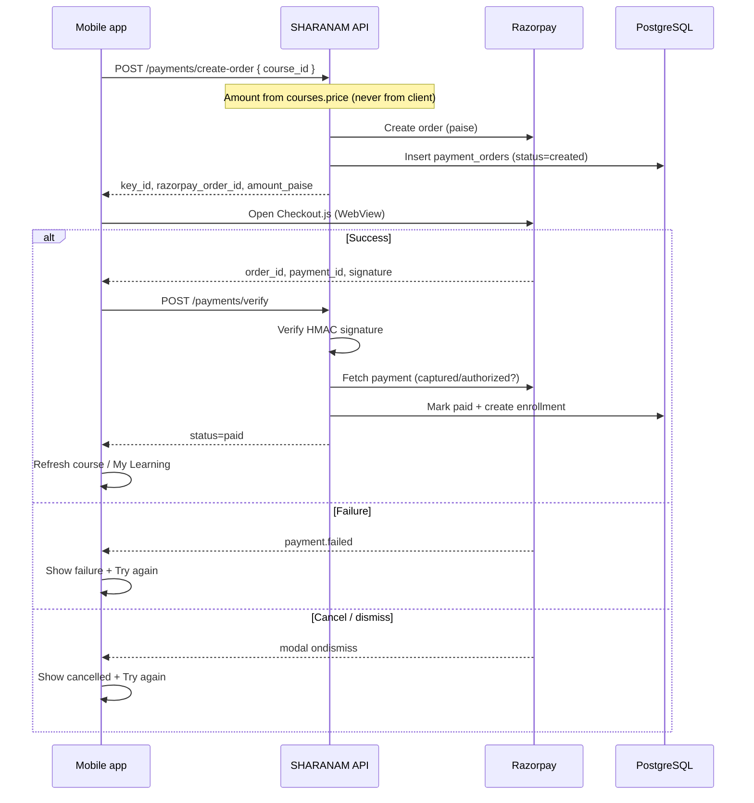

# Buy Course — payment flow

## What the student sees

**Buy Course** screen (`BuyCourse`):

| Field | Source |
|-------|--------|
| Course Name | `courses.title` |
| Teacher | `teacher_name` (fallback SHARANAM Faculty) |
| Price | `compare_at_price` if set, else `price` |
| Discount | `Price − Final` (₹0 when no MRP) |
| Final Amount | `courses.price` (what Razorpay charges) |
| **Buy Now** | Starts checkout |

Entry: Course Detail → **Buy · ₹…** (paid courses only). Free courses still use **Enroll Free**.

---

## Payment flow (step by step)

### Loading states

1. **Creating order** — after Buy Now, before Checkout opens  
2. **Checkout open** — Razorpay UI in WebView  
3. **Verifying** — after Checkout success, while API confirms payment  

### Success / failure / cancel

| Outcome | Screen |
|---------|--------|
| Success | **Payment Successful** — Thank you! · Course Unlocked · **Go To Course** |
| Failure / Cancel | **Payment Failed** — **Try Again** · **Contact Support** |

**Security:** Checkout “success” alone does not unlock the course. The API verifies the signature and fetches the payment from Razorpay before creating an enrollment.

---

## Files

| File | Role |
|------|------|
| `modules/payments/screens/BuyCourseScreen.tsx` | Summary UI + state machine |
| `modules/payments/components/BuyCourseSummary.tsx` | Name / teacher / price rows |
| `modules/payments/components/RazorpayCheckoutWebView.tsx` | Checkout.js in WebView |
| `modules/payments/utils/coursePricing.ts` | Price / discount / final |
| `modules/payments/utils/buildRazorpayCheckoutHtml.ts` | Checkout HTML bridge |
| `services/payment.service.ts` | `POST /payments/create-order` + `/verify` |

---

## Prerequisites

1. Apply `payment_orders` migration in Supabase  
2. Set `RAZORPAY_KEY_ID` / `RAZORPAY_KEY_SECRET` in `apps/api/.env`  
3. Optional: `EXPO_PUBLIC_RAZORPAY_KEY_ID` (Checkout prefers `key_id` from create-order response)  
4. Restart API after env changes  
