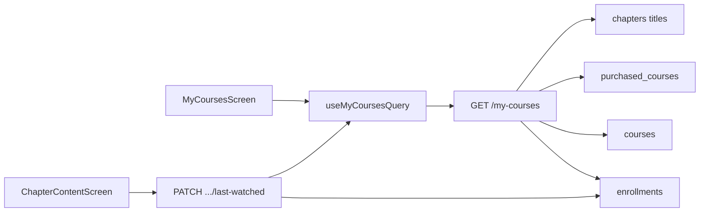

# My Courses — architecture

## What the screen shows

**My Courses** tab (formerly My Learning):

| Feature | Behavior |
|---------|----------|
| Purchased / owned only | Courses with an `enrollments` row (buy or free enroll) |
| Search | Debounced `?search=` on title / teacher |
| Continue Learning | Banner for most recent `last_watched_*` |
| Progress bar | `enrollments.progress_percent` (0–100) |
| Last watched chapter | Title from `last_watched_chapter_id` |
| Thumbnail | `courses.thumbnail_url` |
| React Query | `queryKeys.myCourses(search)` — `staleTime` 60s |

---

## Architecture

### Layers

| Layer | Files |
|-------|--------|
| UI | `modules/my-courses/screens/MyCoursesScreen.tsx`, `MyCourseCard`, `ContinueLearningBanner`, `ProgressBar` |
| Hooks | `useMyCoursesQuery` — React Query cache keyed by search |
| Mobile API | `services/myCourse.service.ts` |
| Routes | `GET /my-courses`, `PATCH /my-courses/:courseId/last-watched` |
| Service | `apps/api/src/services/myCourse.service.ts` |
| Types | `MyCourseItem`, `MyCoursesPage` in `@sharanam/shared` |
| DB | `enrollments` + `last_watched_*` columns; optional `purchased_courses` for `is_purchased` |

### Caching

- Query key: `['my-courses', { search }]`
- `staleTime: 60_000` — tab switches reuse cache
- Invalidated after enroll, payment verify, and chapter open (last-watched)

### Continue Learning

1. Opening a chapter → `PATCH /my-courses/:courseId/last-watched`
2. List orders by `last_watched_at`
3. Banner + card CTA → `ChapterContent` for that chapter

---

## Migrations to apply

1. `20260801020000_purchased_courses.sql` (if unpaid purchases need `is_purchased` badge)
2. **`20260801030000_enrollment_last_watched.sql`** (required for last watched / continue)
